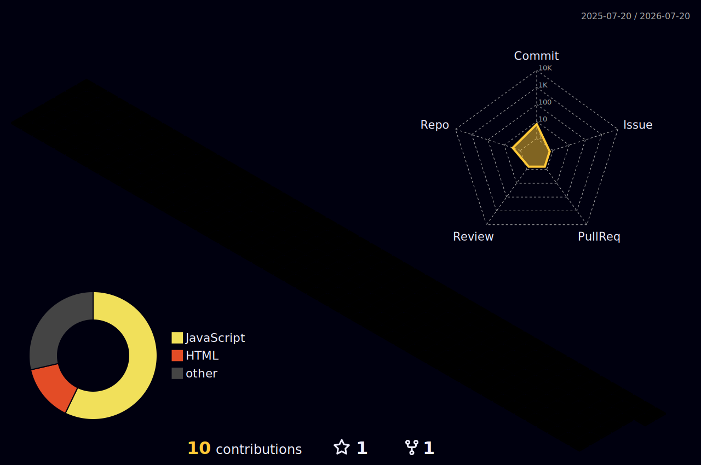

<!-- ========================= HEADER ========================= -->

  

  
  
  
  

<!-- ========================= ABOUT ========================= -->
##  About Me

- 🚀 Full Stack Developer with **4+ years** building scalable enterprise web applications
- 🏦 Delivered production-grade backend solutions for banking-sector clients including **Banque du Caire**
- 🧩 Specialised in **Laravel, Node.js, Vue.js, and WordPress** — REST APIs, microservices, headless CMS
- 🌍 **Open to European opportunities** — available to self-fund visa and relocation costs
- 📫 Reach me at **islam8bahaa@gmail.com**

<!-- ========================= TECH STACK ========================= -->
## 🛠️ Tech Stack

  
  
  
  
   
  
  
  
  
   
  
  
  
   
  
  
  
  

<!-- ========================= 3D CONTRIBUTIONS ========================= -->
## 🧊 3D Contribution Skyline

  

<!-- ========================= STATS ========================= -->
## 📊 GitHub Analytics

  
  

  

  

<!-- ========================= TROPHIES ========================= -->
## 🏆 Trophies

  

<!-- ========================= FOOTER ========================= -->

<i>⚡ Currently building Laravel REST APIs and Node.js/Strapi backends for enterprise clients.</i>

